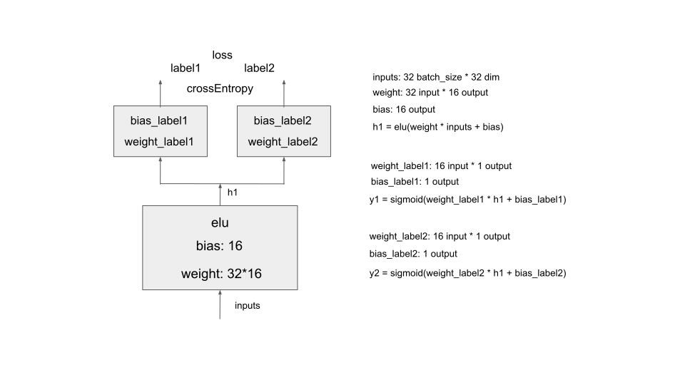
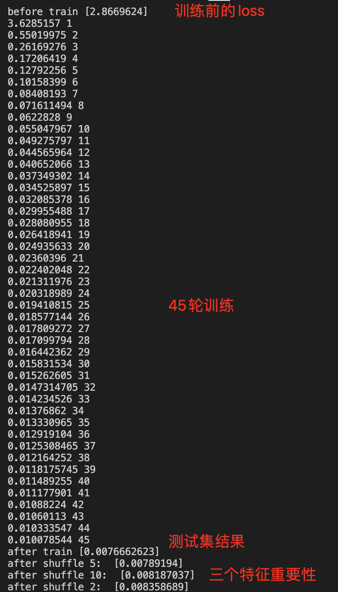

# 一、特征重要性分析文档
## shuffle方法
某dense特征或sparse特征，按列随机shuffle。shuffle后重新evaluate，分析loss，判断该特征对最终结果的影响  
https://christophm.github.io/interpretable-ml-book/feature-importance.html  

## 基于shuffle方法的泰勒展开方法（计算加速）
shuffle方法需要遍历每个特征后shuffle，落地成本高。以下paper通过泰勒一阶展开模拟，实现计算加速
https://arxiv.org/abs/2308.09395

# 二、代码解析
## 1. 构建MTL模型、训练图结构 及 训练数据集，完成训练
```注释1～2```构造图结构（未使用tf高阶api），```tf.Variable```手写。```注释3```模拟数据集：5个sparse特征（每个维度为4维），20个dense特征  
 

## 2. 构造测试集，在训练完成后测试loss
```注释4```构造测试集，```注释5```完成shuffle前测试。与shuffle后结果对比    

## 3. shuffle方法分析重要性
```注释6```挑选第5，10个dense特征，及第2个sparse特征，分析特征重要性  

## 4. 泰勒展开方法
```注释7```通过泰勒展开方法，分析sparse特征重要性。具体公式为abs((avg(emb)-emb)*gradient)的滑动平均

## 5. 结果
 